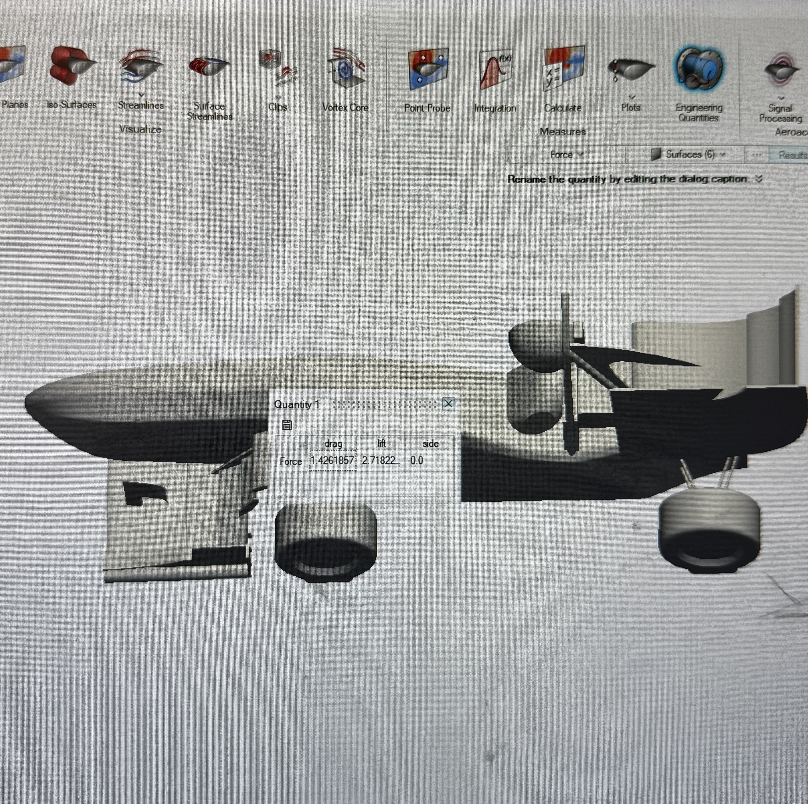
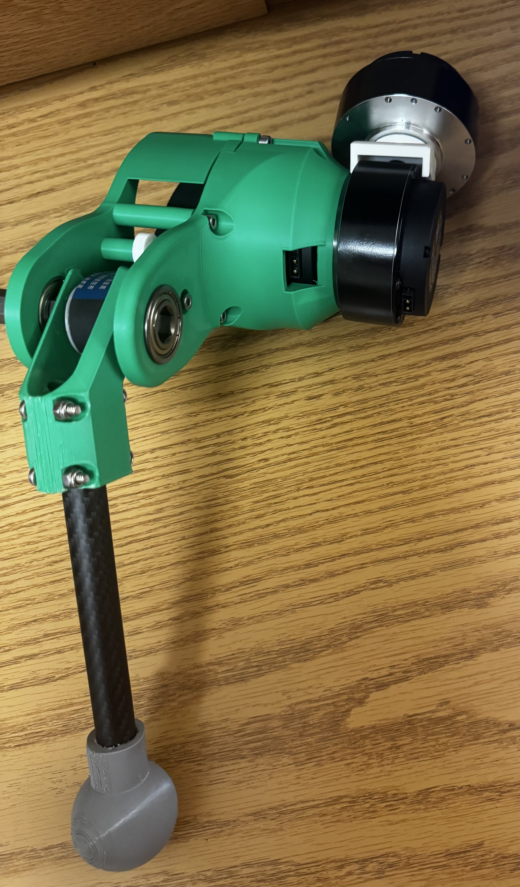
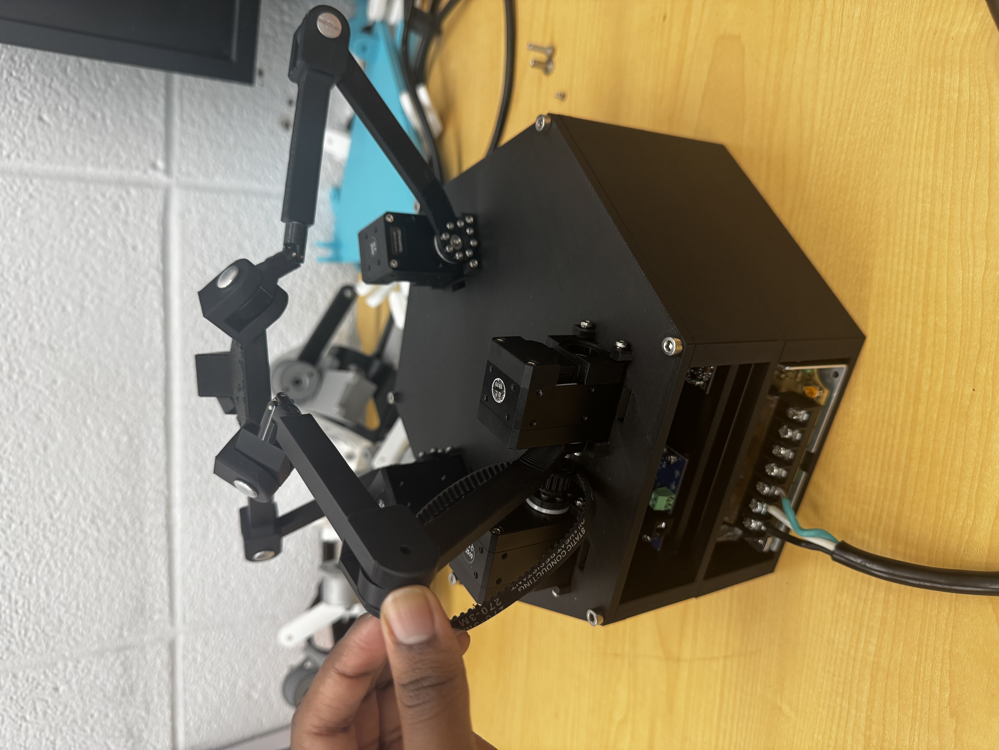

# Hi there 👋

---

## Featured Projects

<table>
<tr>

<td width="33%" align="center">

### Formula Racing Aerodynamics

  

</td>

<td width="33%" align="center">

### Quadruped Leg

  

</td>

<td width="33%" align="center">

### Hippotherapy Simulator Research

  

</td>

</tr>
</table>

---

<table>
<tr>

<td width="25%" valign="top">

</td>

</tr>
</table>

